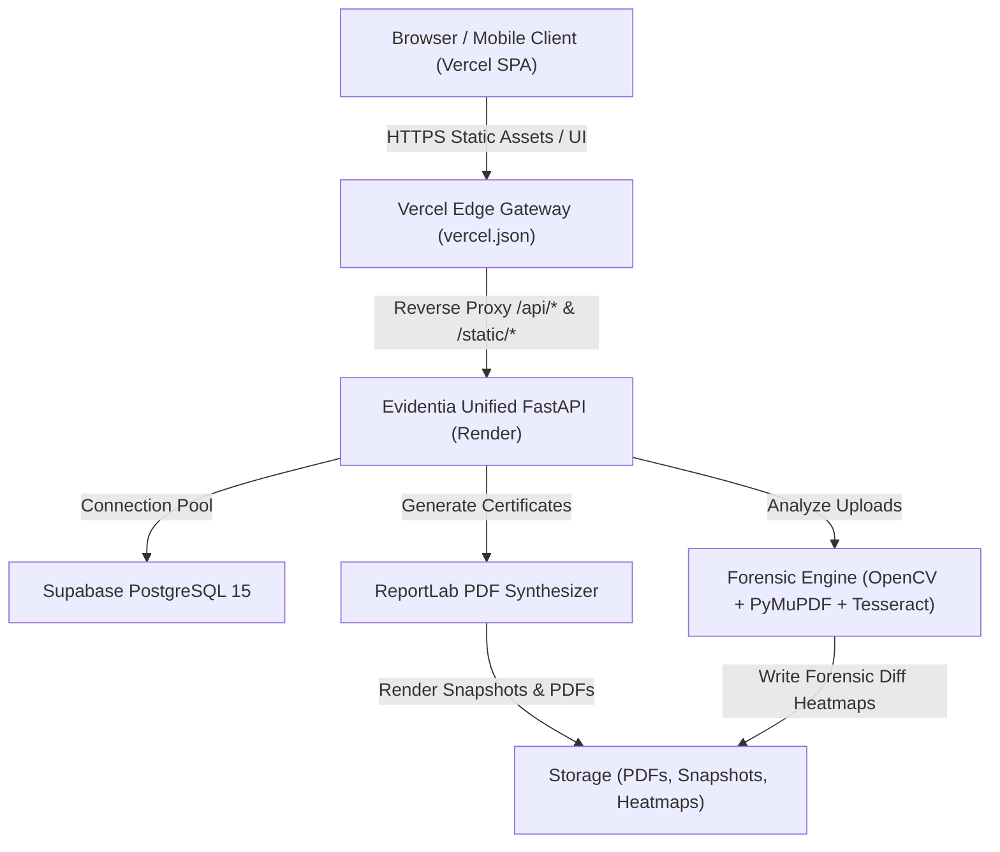

# EVIDENTIA: Master System Architecture & Technical Context Specification

> **System Name:** Evidentia (formerly Agnitia)  
> **Tagline:** Proof in Every Pixel — Forensic Cryptographic Document Issuance & Verification Engine  
> **Live Web App:** `https://evidentia-web.vercel.app`  
> **Live API Backend:** `https://evidentia-api-ig4f.onrender.com`  
> **Repository:** `https://github.com/Santoshray-27/document-verification-v1.git`  
> **Target Audience:** AI Assistants, Software Architects, Security Engineers, DevOps Auditors.

---

## 1. Executive Summary & Core Mission

**Evidentia** is a zero-trust cryptographic document issuance and multi-layer forensic verification platform. It solves the endemic crisis of forged diplomas, counterfeit certificates, tampered transcripts, and falsified official documents.

Unlike naive QR-code or basic blockchain stamp systems (which only link to a URL or hash the whole file without deep forensic inspection), Evidentia introduces:
1. **Canonical ECDSA P-256 Signatures**: Field-level canonicalization and signing directly tied to an on-chain/cryptographic Issuer Key Registry (`kid`).
2. **Deterministic Vector Document Generation**: Generates high-fidelity PDF certificates (A4 / Landscape / Custom layouts) with embedded QR codes, watermarks, micro-guilloche patterns, and pixel-perfect canonical layout structure.
3. **Four-Layer Forensic Tamper Engine**:
   - **Layer 1: Cryptographic Integrity** (ECDSA P-256 with SHA-256 manifest verification).
   - **Layer 2: Structural Diff & Heatmap** (Native Computer Vision SSIM comparison against the immutable original vector snapshot to detect modified pixels, moved text, or forged stamps).
   - **Layer 3: OCR & Semantic Integrity** (Tesseract / Text-extraction cross-matching against canonical field values, flags substitutions like misspelled names or grades).
   - **Layer 4: Digital Forensic Metadata Inspection** (Detects Adobe Photoshop, GIMP, Canva edit traces, date discrepancies, PDF object streams, and font inconsistencies).

---

## 2. Complete Technology Stack

| Layer | Technologies & Frameworks | Key Libraries / Drivers |
| :--- | :--- | :--- |
| **Frontend UI** | **React 18**, **Vite 5**, **TailwindCSS** | `framer-motion`, `lucide-react`, `axios`, `react-router-dom`, `canvas-confetti`, `xlsx` |
| **Unified Backend** | **Python 3.11**, **FastAPI**, **Uvicorn** | `pydantic`, `PyJWT`, `passlib[bcrypt]`, `cryptography` |
| **Database & Persistence**| **Supabase (PostgreSQL 15)** via connection pooling | `psycopg2-binary`, SSL mode `require`, `RealDictCursor` |
| **Forensics & Vision** | **OpenCV (`opencv-python-headless`)**, **PyMuPDF (`fitz`)**, **Tesseract OCR** | `pyzbar` / OpenCV QRCodeDetector, `pytesseract`, Pillow (`PIL`), NumPy |
| **Document Synthesis**| **ReportLab 4.x** (Vector PDF engine) | Custom drawing flowables, CIDFonts, vector borders, dynamic QR rasterization |
| **Deployment / CI/CD** | **Vercel** (Frontend SPA + Reverse Proxy), **Render** (FastAPI Web Service), **GitHub** | Git Worktrees, Python `.python-version` (3.11.9) |

---

## 3. High-Level Architecture Diagram



---

## 4. Database Schema Specification (Supabase PostgreSQL)

The backend utilizes high-performance pooled relational tables in Supabase:

### 1. `users` Table
Stores authenticated administrative and issuer accounts.
- `id`: `SERIAL PRIMARY KEY` (integer)
- `name`: `TEXT NOT NULL`
- `email`: `TEXT UNIQUE NOT NULL` (indexed, lower-case)
- `password_hash`: `TEXT NOT NULL` (Bcrypt hash)
- `role`: `TEXT NOT NULL` (`admin` or `issuer`)
- `issuer_id`: `TEXT REFERENCES issuers(issuer_id)`
- `created_at`: `TEXT / TIMESTAMP`

### 2. `issuers` Table
Organizations recognized in the public cryptographic directory.
- `issuer_id`: `TEXT PRIMARY KEY` (e.g., `iss_c4dbd09e`)
- `name`: `TEXT NOT NULL` (e.g., "Oriental University")
- `org_type`: `TEXT NOT NULL` (`university`, `school`, `government`, `corporate`, `other`)
- `status`: `TEXT NOT NULL` (`active`, `suspended`, `revoked`)
- `created_at`: `TEXT NOT NULL`

### 3. `issuer_keys` Table
Cryptographic Key Pairs used for ECDSA P-256 signatures.
- `kid`: `TEXT PRIMARY KEY` (e.g., `key_8f1a23c4`)
- `issuer_id`: `TEXT REFERENCES issuers(issuer_id)`
- `public_key_pem`: `TEXT NOT NULL` (X.509 SubjectPublicKeyInfo PEM)
- `private_key_path`: `TEXT NOT NULL` (Secure path on storage or encrypted vault)
- `algorithm`: `TEXT NOT NULL` (`ECDSA-P256-SHA256`)
- `status`: `TEXT NOT NULL` (`active`, `revoked`)
- `created_at`: `TEXT NOT NULL`

### 4. `documents` Table
Registry of all issued certificates and their cryptographic commitments.
- `doc_id`: `TEXT PRIMARY KEY` (e.g., `DOC-2026-9B3E1F`)
- `issuer_id`: `TEXT REFERENCES issuers(issuer_id)`
- `kid`: `TEXT REFERENCES issuer_keys(kid)`
- `recipient_name`: `TEXT NOT NULL`
- `course`: `TEXT NOT NULL`
- `grade`: `TEXT`
- `certificate_number`: `TEXT NOT NULL`
- `issue_date`: `TEXT NOT NULL`
- `manifest`: `TEXT NOT NULL` (Canonical JSON manifest string)
- `signature`: `TEXT NOT NULL` (Base64 ECDSA P-256 signature)
- `fields_hash`: `TEXT NOT NULL` (SHA-256 of canonical fields)
- `file_hash`: `TEXT NOT NULL` (SHA-256 of generated PDF bytes)
- `status`: `TEXT NOT NULL` (`valid`, `revoked`, `suspended`)
- `pdf_path`: `TEXT` (Relative path to storage)
- `snapshot_path`: `TEXT` (Original 300DPI vector render snapshot)
- `created_at`: `TEXT NOT NULL`

### 5. `templates` Table
Stores pre-designed or custom visual certificate layouts.
- `template_id`: `TEXT PRIMARY KEY`
- `name`: `TEXT NOT NULL`
- `orientation`: `TEXT` (`portrait`, `landscape`)
- `layout_json`: `JSONB` (Positions of fields, logos, seals, fonts, borders)
- `is_default`: `BOOLEAN`

---

## 5. Cryptographic Protocol & Data Integrity Flow

### Step 1: Field Canonicalization
Field ordering and serialisation are deterministic.
```python
# Canonical JSON (RFC 8785 strict subset)
payload = {
    "certificate_number": "CERT-2026-001",
    "course": "Bachelor of Technology in Computer Science",
    "doc_id": "DOC-998811",
    "grade": "First Class with Distinction",
    "issue_date": "2026-05-15",
    "issuer_name": "Oriental University",
    "name": "Jane Doe"
}
fields_hash = SHA256(canonicalize(payload))
```

### Step 2: Manifest Construction
```json
{
  "schema_version": 1,
  "doc_id": "DOC-998811",
  "issuer_id": "iss_c4dbd09e",
  "kid": "key_8f1a23c4",
  "fields_hash": "e3b0c44298fc1c149afbf4c8996fb92427ae41e4649b934ca495991b7852b855",
  "file_hash": "c5f590409a65f1ef1e88849b291a136d24669866ad5083fc80d60d3d52d366d7",
  "issued_at": "2026-10-10T01:30:00Z",
  "expires_at": null
}
```

### Step 3: ECDSA P-256 Signing
The canonical manifest string is signed using the Issuer's private key (`secp256r1` with SHA-256) producing an ASN.1 DER signature encoded in Base64:
$$\text{Signature} = \operatorname{Sign}_{K_{priv}}(\operatorname{SHA256}(\text{Manifest}))$$

### Step 4: Verification Pipeline
When a verifier uploads a document or scans a QR code:
1. Decode QR code &rarr; extracts `doc_id`, verification URL, and public key claim.
2. Lookup `doc_id` in database &rarr; fetch registered `public_key_pem`, `signature`, and `manifest`.
3. $\operatorname{Verify}(K_{pub}, \text{Manifest}, \text{Signature})$:
   - If invalid &rarr; **TAMPERED (Cryptographic Signature Mismatch)**.
4. Compute $\operatorname{SSIM}(\text{Uploaded Image}, \text{Immutable Snapshot})$:
   - If $< 0.98$ &rarr; Highlighting altered pixel heatmaps.
5. Extract OCR / PDF text &rarr; fuzzy compare text with manifest fields.
6. Inspect PDF metadata streams &rarr; identify forensic tampering signals (e.g., Photoshop layers, font embeds modified).

---

## 6. Directory Structure Breakdown

```
agnitia/
├── backend-node/               # Legacy Node.js backend (Reference implementation)
│   ├── src/                    # Controllers, middleware, routes
│   └── storage/                # Persisted storage (issued/, uploaded/, snapshots/, heatmaps/)
│
├── worker-python/              # Unified Production FastAPI Backend (Active on Render)
│   ├── main.py                 # FastAPI application root & API router registry
│   ├── db.py                   # Threaded Supabase connection pool manager
│   ├── crypto_service.py       # ECDSA P-256 signing, verifying & key generation
│   ├── routers_auth.py         # Login, Registration, JWT sessions
│   ├── routers_issuer.py       # Single issuance, document list, dashboard stats
│   ├── routers_bulk.py         # Bulk Excel/CSV certificate issuance & batch processing
│   ├── routers_templates.py    # Template catalog & dynamic PDF previews
│   ├── routers_verify.py       # 4-layer multi-engine verification pipeline
│   ├── routers_reports.py      # Verification audit logs & forensic reporting
│   ├── routers_branding.py     # Custom issuer logos, seals, signatures
│   ├── routers_public.py       # Public registry of trusted institutions
│   ├── services/
│   │   ├── diff_service.py     # Native OpenCV SSIM calculation & bounding box heatmaps
│   │   ├── ocr_service.py      # Tesseract OCR & certificate field extraction
│   │   ├── pdf_service.py      # PyMuPDF (fitz) rendering & metadata extraction
│   │   ├── qr_service.py       # QR code detection & payload decoding
│   │   ├── template_service.py # ReportLab vector PDF synthesis engine (12+ themes)
│   │   └── verdict_service.py  # Forensic verdict classification & confidence scoring
│   ├── requirements.txt        # Python dependency manifest
│   └── .python-version         # Pinned to 3.11.9 for cloud build stability
│
├── frontend-react/             # High-Performance React 18 SPA (Active on Vercel)
│   ├── vercel.json             # Reverse proxy config (/api/* -> Render backend)
│   ├── vite.config.js          # Vite build config with localhost dev proxies
│   ├── package.json            # NPM dependencies
│   ├── src/
│   │   ├── api/
│   │   │   └── axios.js        # Global Axios instance with error normalization
│   │   ├── context/
│   │   │   └── AuthContext.jsx # Auth state, login/register methods, JWT token persistence
│   │   ├── pages/
│   │   │   ├── Landing.jsx     # Modern Brutalist hero, live demo, cryptographic explanation
│   │   │   ├── Login.jsx       # Issuer authentication with live error banner
│   │   │   ├── Register.jsx    # Issuer self-registration with org types
│   │   │   ├── issuer/
│   │   │   │   ├── Dashboard.jsx      # Metrics (Total issued, verification requests, pass rate)
│   │   │   │   ├── IssueDocument.jsx  # Single document issuance wizard with instant preview
│   │   │   │   ├── BulkIssuance.jsx   # Drag & drop Excel parser with batch issuance
│   │   │   │   ├── MyDocuments.jsx    # Document table with download, revoke, verify links
│   │   │   │   ├── TemplateStudio.jsx # Visual template selector & customization
│   │   │   │   ├── Reports.jsx        # Verification logs, geographic/device metrics
│   │   │   │   └── Settings.jsx       # Organization profile, API keys, public keys
│   │   │   └── verifier/
│   │   │       ├── VerifyPage.jsx     # Drag-and-drop document upload + QR code scanner
│   │   │       └── ResultPage.jsx     # Forensic breakdown, diff heatmap, confidence scores
│   │   └── templates/          # Visual design system tokens & certificate themes
│
└── docs/                       # Architecture, PRD, Security Audit, API Contracts
```

---

## 7. Key API Endpoints Specification

### Authentication & Profiles (`/api/auth`)
- `POST /api/auth/register`: Register new organization (Generates `issuer_id` and ECDSA P-256 `kid` automatically).
- `POST /api/auth/login`: Authenticate issuer with email and password &rarr; Returns JWT.
- `GET /api/auth/me`: Current session info & associated organization.

### Document Issuance (`/api/issuer`)
- `POST /api/issuer/issue`: Generates vector PDF, computes hashes, signs manifest, creates snapshot, stores record.
- `GET /api/issuer/documents`: Fetch all documents issued by organization.
- `POST /api/issuer/revoke`: Revoke an issued certificate with audit reason.
- `GET /api/issuer/dashboard`: Aggregate KPI metrics (total issued, verified, pass rates).

### Bulk Processing (`/api/issuer/bulk`)
- `POST /api/issuer/bulk-issue`: Accepts Excel/CSV payload &rarr; performs batch signing, returns downloadable ZIP package.

### Multi-Layer Verification (`/api/verify`)
- `POST /api/verify/analyze`: Upload file &rarr; run QR detection, OCR extraction, metadata inspection.
- `POST /api/verify/document`: Complete end-to-end verification against database records & snapshot SSIM diff.

### Public Directory (`/api/public`)
- `GET /api/public/issuers`: Searchable list of registered institutions and public keys.
- `GET /api/public/verify/{doc_id}`: Public certificate view with live cryptographic status.

---

## 8. Deployment Architecture & Environment Configuration

### Vercel (Frontend SPA & API Reverse Proxy)
- **Root Directory**: `frontend-react`
- **Output Directory**: `dist`
- **`vercel.json` Setup**:
  ```json
  {
    "rewrites": [
      { "source": "/api/(.*)", "destination": "https://evidentia-api-ig4f.onrender.com/api/$1" },
      { "source": "/static/(.*)", "destination": "https://evidentia-api-ig4f.onrender.com/static/$1" },
      { "source": "/(.*)", "destination": "/index.html" }
    ]
  }
  ```
  *Benefit:* Completely prevents CORS blocks and handles same-origin cookie/header forwarding.

### Render (Unified Python FastAPI Backend)
- **Root Directory**: `worker-python`
- **Runtime**: Python 3.11.9
- **Build Command**: `pip install --upgrade pip && pip install -r requirements.txt`
- **Start Command**: `python -m uvicorn main:app --host 0.0.0.0 --port $PORT`
- **Key Environment Variables**:
  - `DATABASE_URL`: Supabase Pooled Connection String (`aws-0-ap-northeast-2.pooler.supabase.com:6543`)
  - `JWT_SECRET`: 256-bit cryptographically secure secret string.
  - `PYTHON_VERSION`: `3.11.9`

---

## 9. Context Guide for AI Assistants

When instructing an AI to work on this repository:
1. **Never break cryptographic contract parity**: Canonical hashing order in `crypto_service.py` is immutable. Changing key order breaks existing signatures.
2. **Dual-mounted routes**: In `worker-python/main.py`, routers are mounted with both `/api` prefix and root (`/`) to preserve compatibility with legacy clients and modern reverse proxies.
3. **Responsive UI Rules**: When modifying frontend components, retain the neo-brutalist / technical aesthetic (sharp borders, monospaced metadata, subtle amber/emerald security accents, mathematical precision).
4. **Local Development**:
   - Backend runs on `http://localhost:4000` via Uvicorn.
   - Frontend runs on `http://localhost:5173` via Vite with internal proxy.
